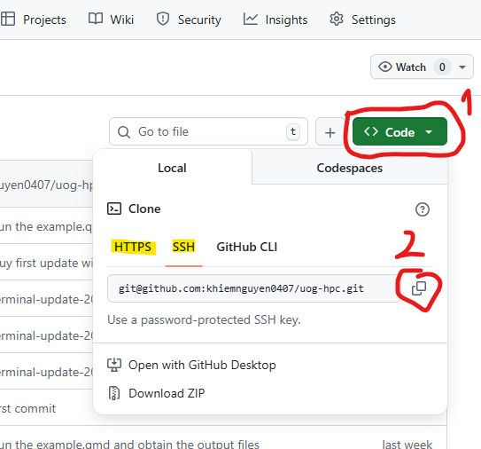
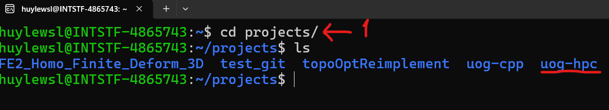

# Foreword

Git and GitHub has a long history and it has been developed with in-depth and sophisticated technical features under the hood. This tutorial aims to provide readers with a direct guidance for using GitHub. The material gives step-by-step instructions by which one can apply it for their work and can have an adequate starting point for self-learning of GitHub.

Like many other software-based procedures, there are multiple ways to perform a task using GitHub. In this tutorial, we steer our focus on methods which are considered as "good practice" in terms of sustainable programming development which were suggested and recommended by the Git's user community.

# Installation of `Git`

Git goes with WSL by default, so if you are using WSL or Linux operating system, you do not have to do the installation.
If you are working with Windows or Mac, you need to install Git. The instruction for installation from Git's official website is straightforward, so for this point readers are directed to the website, [here](https://git-scm.com/install/), to install Git.

# Connect your local machine to a GitHub's repository
## Introduction to `terminal`
Using Git, you will mostly do the operations via a `terminal`. So, it is worth to give a brief description of the term `terminal`. For ones who are already familiar with `terminal` can skip this part.

To have a sense of what `terminal` is, it could be described in a rudimentary way as that "*A terminal is a program that allows you to interact with your computer by typing text commands instead of clicking buttons.*"

In everyday computer use, people usually interact with a graphical interface (GUI):

- clicking folders

- dragging files

- pressing buttons

A terminal provides a text-based interface to the operating system. Instead of clicking, you type commands that tell the computer what to do. For example, to list files and folders currently in the directory, in a `terminal` (assume the `bash terminal` is used), we type: 
```bash
    ls
```
and then we will see somethings like:
```
    project
    python_file.py
    cpp_file.cpp
```

## Create a GitHub's repository
The very first thing to do is creating a repository ('repo' for short) where your project is managed. To do this, open your user navigation menu (the round icon on the top-right corner), then click `Repositories`, see the picture below:

{width=40%}

And then, click the green `New` button:

{width=50%}

Finally, configure your repo by filling the boxes, with the important thing being "Choose visibility" of "Public/Private". After that, click "Create repository" to create the repo

{width=50%}

## Connect to a GitHub's repository
Basically, there are two cases to get connected to a GitHub's repo, including connecting to your own GitHub repo and connect to a repo that you are invited by your collaborator. Both cases are done in a very similar way, through either `HTTPS` or `SSH` protocol. 

`HTTPS` and `SSH` are protocols used by Git to communicate with remote repositories (e.g., GitHub), with the difference mainly lying in authentication, security mechanism, and workflow convenience.

Either you are connecting to your own repo or to the repo you were invited, the first thing to do is go to that repo to get the directory URL. Depending on which method you prefer, you will select `HTTPS` or `SSH` to get the link. At this point, we work through `HTTPS` and `SSH`, while leave `GitHub CLI` in later topic. 

{width=50%}


### HTTPS - HyperText Transfer Protocol Secure (good for quick or temporary access)
By doing this way, when GitHub needs authentication, you will have to use "**Personal Access Token (PAT)**" (*this setup is left for you to find how to do yourself*).

Using the copied `HTTPS` URL, you can now `clone` the repo to your local directory where your want to put your project in your local machine. In you terminal, type

```bash
    git clone <your copied HTTPS URL>
```

For example,

```bash
    git clone https://github.com/khiemnguyen0407/uog-hpc.git
```

To test the job, in your terminal, at the folder you keep the cloned repository, type `ls` to see whether the repo was sucessfully cloned to you local repo. See the following example of my case, first I go to my `projects` folder where I put the cloned repo of `uog-hpc`, and then `ls`.

{width=80%}


### SSH - Secure Shell (good practice and recommended)
We will go in detail of how to get connected through `SSH` protocol. It is considered as a good practice and is recommended for a long-term use of GitHub. Some of the advantages are:

- No repeated login
- Very convenient for frequent Git use
- More natural workflow for developers
- Preferred for automated systems (HPC, CI, etc.)

SSH authenticates by using the so-called "**public–private key cryptography**", which generates a "`private key`", only kept on your machine, and a "`public key`", kept on both your machine and on you GitHub account. Followings are steps to setup the SSH authentication.

#### Step-by-step setup for SSH authentication:

Step 1: Generate the key: in your terminal type, and fill it with your email which you used to register your GitHub account

```bash
    ssh-keygen -t ed25519 -C "your_email@example.com"
```

For example, my case is

```bash
    ssh-keygen -t ed25519 -C "huy.lequang.ce@gmail.com"
```

Then, press Enter to choose the default location for storing the key (you can choose your own custom location, but we should do so unless you do have a purpose on this)

Next, enter your `passphrase` (it is like a password) to protect your `private key`. It is optional, but it provides one more layer to protect your `private key` from being exposed to someone else. (Imagine some one use your machine and open the file to have your `private key`)

Step 2: Start the SSH agent: in your terminal type

```bash
    eval "$(ssh-agent -s)"
    ssh-add ~/.ssh/id_ed25519
```

Step 3: Copy the `public key` in order to add to your GitHub account. In your terminal, type

```bash
    cat ~/.ssh/id_ed25519.pub
```
, and then copy the whole line.

Step 4: Add the key to your GitHub account: go to your GitHub settings (click on your account icon) --> go to "SSH and GPG keys" --> click "New SSH key" to add the key by pasting the copied content at Step 3. Note that, GitHub allows **multiple SSH keys per account**, so if you have other authentications (other machine), you can leave them untouched, and add the new SSH key.

Step 5: Test the authentication: in your terminal, type

```bash
    ssh -T git@github.com
```
, then you should see something like: 

```
Hi huyle-ce! You've successfully authenticated, but GitHub does not provide shell access.
```

Step 6: now, you can clone a repository that you have permission to clone, which can be either an invited or your own one. First, go to GitHub and copy the SSH address from the repository you want to clone, then clone it by command line:
   
   ```bash
   git clone git@github.com:path/repository.git
   ```

Now, you can work with your local and GitHub repositories by pulling, pushing, and so on.

#### Understanding about **public–private key cryptography**:
After going through the procedure for setting up the SSH authentication above, it is worth to have a sense on how it works.

When doing `git clone git@github.com:user/repo.git`, the SSH protocol runs to establish a SSH channel to the GitHub's directory. Next, the SSH sends the `public key` to GitHub, and then GitHub compares this particular key with the `stored public keys`.

So, GitHub knows that this connection (or loosely speaking, this machine) is trying to authenticates as *account X* which holds the matched `public key`. Through the SSH channel, the `public key` of the account X is checked with the `private key` of the machine. If they match, the account is authenticated to be authorized by the machine, and so get connected.

When you try to clone a repository via SSH protocol, GitHub will check whether your account has permission for cloning this repository.

There are actually many complicated technical features behind the scene, but for a benign understanding, it can be thought of `private key` as a key and the `public key` as a lock. Your machine knows the key and the lock, while your GitHub's account holds the lock. By connecting to your GitHub account through SSH, you are asking GitHub to find the account with this "lock" and then use the "key" to open that "lock". If someone else can have your `public key` in their hand, and try to ask GitHub to connect themselves to your account, then they cannot as their machine does have the "key" - `private key` - to open the "lock" that GitHub show them.


# Get acquainted with Git through a simple workflow


