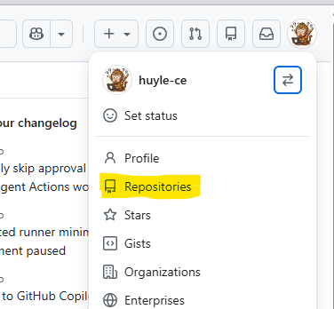
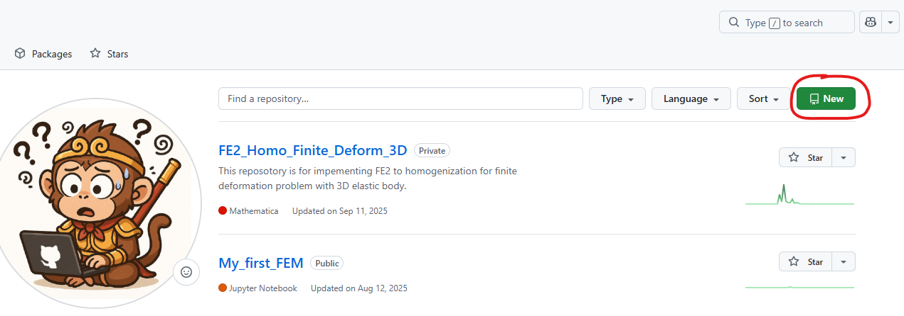
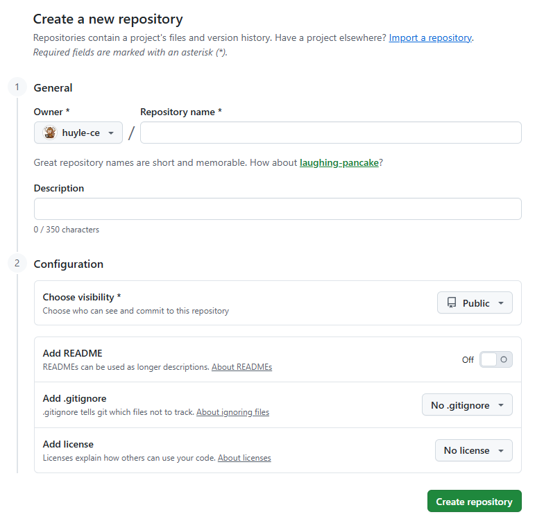

# Foreword

Git and GitHub has a long history and it has been developed with in-depth and sophisticated technical features under the hood. This tutorial aims to provide readers with a direct guidance for using GitHub. The material gives step-by-step instructions by which one can apply it for their work and can have an adequate starting point for self-learning of GitHub.

Like many other software-based procedures, there are multiple ways to perform a task using GitHub. In this tutorial, we steer our focus on methods which are considered as "good practice" in terms of sustainable programming development which were suggested and recommended by the Git's user community.

# Installation of `Git`

Git goes with WSL by default, so if you are using WSL or Linux operating system, you do not have to do the installation.
If you are working with Windows or Mac, you need to install Git. The instruction for installation from Git's official website is straightforward, so for this point readers are directed to the website, [here](https://git-scm.com/install/), to install Git.

# Connect your local machine with GitHub
## Introduction to `terminal`
Using Git, you will mostly do the operations via a `terminal`. So, it is worth to give a brief description of the term `terminal`. For ones who are already familiar with `terminal` can skip this part.

To have a sense of what `terminal` is, it could be described in a rudimentary way as that "*A terminal is a program that allows you to interact with your computer by typing text commands instead of clicking buttons.*"

In everyday computer use, people usually interact with a graphical interface (GUI):

- clicking folders

- dragging files

- pressing buttons

A terminal provides a text-based interface to the operating system. Instead of clicking, you type commands that tell the computer what to do. For example, to list files and folders currently in the directory, in a `terminal` (assume the `bash terminal` is used), we type: 
```bash
    ls
```
and then we will see somethings like:
```
    project
    python_file.py
    cpp_file.cpp
```

## Create a GitHub's repository
The very first thing to do is creating a repository ('repo' for short) where your project is managed. To do this, open your user navigation menu (the round icon on the top-right corner), then click `Repositories`, see the picture below:

{width=40%}

And then, click the green `New` button:

{width=50%}

Finally, configure your repo by filling the boxes, with the important thing being "Choose visibility" of "Public/Private". After that, click "Create repository" to create the repo

{width=50%}

## Connect to a GitHub' repository
### HTTP
### SSH

# Get acquainted with Git through a simple workflow


