# Foreword

High-Performance Computing (HPC) refers to the use of powerful computers that combine many processors to solve problems much faster than a typical personal computer. Instead of relying on a single CPU, HPC systems distribute work across many CPUs or GPUs, allowing complex computations to be performed efficiently.

HPC is widely used in science, engineering, medicine, and data-intensive research. For example, engineers use HPC to run large simulations, process large datasets, train machine learning models, and perform advanced optimisation or uncertainty analysis.

In universities, HPC systems are shared resources that researchers and students access remotely. Because these systems are typically operated through the command line, understanding basic Linux commands and terminal usage is an essential first step to working effectively on an HPC cluster.


# What is HPC?

High-Performance Computing (HPC) uses many interconnected processors to solve computational problems faster than a standard computer. These systems are often organised as **clusters**, where multiple machines work together to perform tasks in parallel.

By distributing workloads across many processors, HPC systems can handle large simulations, data analysis tasks, and computational models that would otherwise take too long to run on a personal computer.

# Why do we use HPC?

Many scientific and engineering problems require more computational power than a typical laptop or desktop can provide. HPC enables researchers to perform large-scale calculations efficiently.

Common reasons for using HPC include:

- Running **large simulations** such as fluid dynamics or structural modelling  
- **Reducing computation time** through parallel processing  
- Handling **large datasets** in scientific or data-driven research  
- Training **machine learning and AI models** that require significant computing resources

# Typical Components of an HPC System

An HPC cluster typically includes several key components:

**Login Nodes**

Login nodes are the entry point to the cluster. Users connect to these nodes remotely to manage files, prepare scripts, and submit jobs.

**Compute Nodes**

Compute nodes perform the actual computations. Jobs submitted by users are scheduled to run on these machines.

**Storage Systems**

Shared storage allows users to access data and results from any node in the cluster.

**Job Scheduler**

A scheduler distributes jobs across available resources such as CPUs, memory, and GPUs. Common schedulers include **SLURM**, **PBS**, and **LSF**.

# How Users Access an HPC Cluster

Users typically access an HPC cluster remotely using **Secure Shell (SSH)**. After logging in, they interact with the system through a terminal to manage files, load software modules, and submit jobs to the scheduler.

To connect to the HPC cluster, open a terminal application. This can be:

- **Terminal** on macOS or Linux  
- **Command Prompt** or **PowerShell** on Windows  

Then run the following command:

```{bash}
ssh <id>@cognition.cose.gla.ac.uk
```

where `<id>` should be replaced with your university or HPC username.

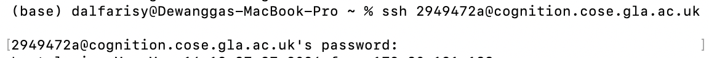{width=80%}

After running the command, you will be prompted to enter your password. While typing the password, **no characters or cursor movement will appear on the screen**. This is normal behaviour in Linux systems for security reasons. Simply type your password carefully and press **Enter**.

During the first login, you may be asked to reset your password. If prompted:

1. Enter your **current password** (the one used to log in).
2. Enter a **new password**.
3. Re-enter the new password to confirm.

Once the password is successfully updated, you will be logged out of the HPC system. Simply put again the ssh sign and re-login with the new password.

# Basic Linux and Terminal Skills for HPC

Most HPC systems run on Linux and are operated through the command line (Command Prompt for Windows, Terminal for Mac and Linux). Therefore, basic familiarity with Linux commands is essential.

Key skills include:

## File System Navigation

When working on an HPC system, most interaction happens through the **file system**.  
Understanding how to check your location and move between directories is essential.

### Check Your Current Location (`pwd`)

The command `pwd` stands for **print working directory**.  It tells you where you currently are in the file system.

Example:

```{bash}
pwd
```

Example output:

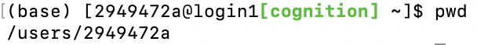{width=80%}

This means you are currently inside your **home directory**.

It is good practice to run `pwd` when you are unsure where you are in the file system.

### List Files and Folders (`ls`)

The `ls` command shows the contents of the current directory.

Example:
```{bash}
ls
```

Example output:

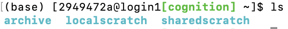{width=80%}

Other significant command is to add -l for showing additional informations.

Example:
```{bash}
ls -l
```

Example output:

{width=80%}

This shows additional information such as:

- file permissions
- file size
- modification time


### Change Directory (`cd`)

The `cd` command allows you to move between directories.

Example:
```{bash}
cd Test
```
Example output:

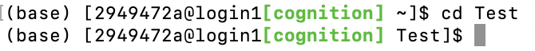{width=80%}

## File Management

File management allows users to create directories, copy files, move files, and remove files within the HPC system. These commands are essential for organising data and managing project files.

The most commonly used commands are:

- `mkdir` – create a new directory  
- `cp` – copy files or directories  
- `mv` – move or rename files  
- `rm` – remove files or directories  
- `sftp` – transfer files between your computer and the HPC system

### Create a Directory (`mkdir`)

The `mkdir` command creates a new folder. The `nano` command create a new text file for our tests.

```{bash}
mkdir newFolder
nano text1.txt
```

When using the nano command, you will encounter movement to different UI, dont worry and for now, just exit the UI.

You can confirm the new folder was created by 
```{bash}
ls
```

Example output:

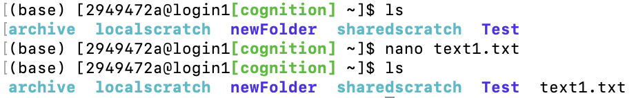{width=80%}


### Copy Files (`cp`)

The `cp` command copies a file from one location to another.

Example:

```{bash}
cp text1.txt text2.txt
```

Example output:

{width=80%}

This creates a copy of `text1.txt` called `text2.txt`.

You can also copy a file into a directory.

Example:

```{bash}
cp text1.txt newFolder/
```

Example output:

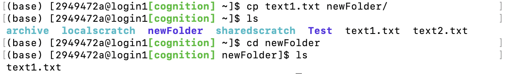{width=80%}

This creates a copy of `text1.txt` inside `newFolder`.

### Move or Rename Files (`mv`)

The `mv` command moves files between directories or renames them.

Rename a file:

```{bash}
mv text1.txt newfile.txt
```

Example output: 

{width=80%}

This renames `text1.txt` to `newfile.txt`

Move a file to directory:

```{bash}
mv text2.txt newFolder/
```

Example output:

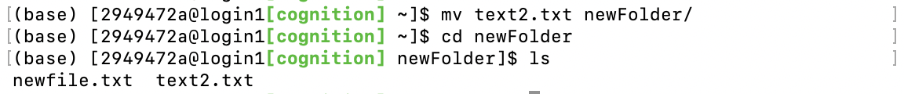{width=80%}

This moves `text2.txt` to `newFolder`


### Remove Files (`rm`)

The `rm` command removes files.

Example:

```{bash}
rm text1.txt
```

Example output:

{width=80%}

This removes `text2.txt`.

To remove a folder, add -r to the given command.

Example:
```{bash}
mkdir removable-folder
ls
rm -r removable-folder
```

Example output:

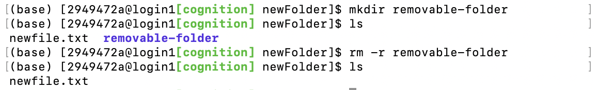{width=80%}

This removes `removable-folder` and all corresponding files inside.

**Important:**  
Files deleted with `rm` are permanently removed.  
There is **no recycle bin or undo option** on most HPC systems.

Always confirm your location before deleting files:

```{bash}
pwd
```

### Transfer Files Using `sftp`

Files can be transferred between your local computer and the HPC cluster using `sftp`.

Start an SFTP session:
```{bash}
sftp <id>@cognition.cose.gla.ac.uk
```

Once connected, you can move your files:

```{bash}
put <file directory>
```

As an example, we want to put the helloworld.ipnyb in our training-files to the hpc system from our local computer.

Example code:

```{bash}
put <file directory>/hello-world.ipynb 
``` 

Example output:

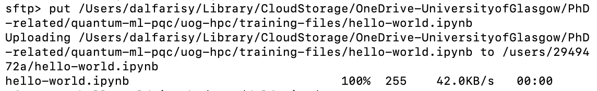{width=80%}


Or download your file from HPC:

As an example, we want to download the same file into our local computer.

```{bash}
get <file/folder in hpc> <file/folder directory> 
```

Example output:

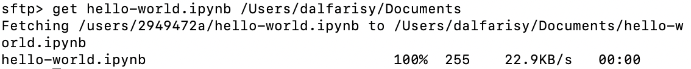{width=80%}

### Practice Example
Here are simple practice example for familiarise yourself with Linux system.

Example code:
```{bash}
mkdir testfolder
nano text1.txt
ls
cp text1.txt testfolder/
mv text1.txt file_backup.txt
ls 
rm file_backup.txt
ls
cd testfolder
ls
```

Example output:

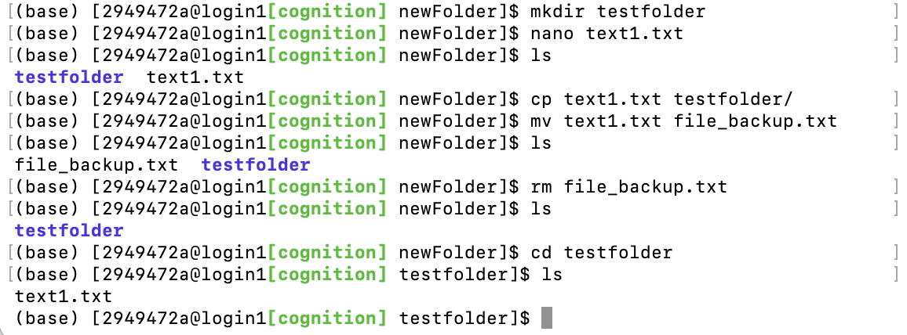{width=80%}

These commands will help you practise creating directories, copying files, moving files, and removing files.

In order to use this training, we upload hpc-text.txt that is shared in this github using SFTP by using:

```{bash}
sftp <id>@cognition.cose.gla.ac.uk
put <directory>/hpc-text.txt
```

## Adding texts to file

### Using echo to create files

We can use echo to create text files,

Example:

```{bash}
echo "This is a test"
```

Example output:

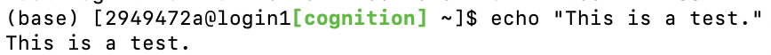{width=80%}

Yes, echo just prints its arguments back out again (hence the name). But combine it with a redirect, and you’ve got a way to easily create small test files:

Now we are saving the words we put in echo as a txt file.

Example:

```{bash}
echo "This is a test" > text1.txt
echo "This is a second test" > text2.txt
```

Example output:

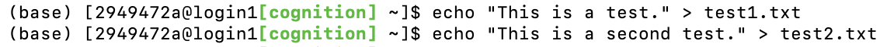{width=80%}

We also can link both files together as one, this is called concatenate. The first two combined will concatenate the file together and the last > will act as saving to a new file.

Example:
```{bash}
cat text_1.txt text_2.txt > cat.txt
```

Example output:

{width=80%}

### Using nano to modify file

Using nano is much more straightforward as we can directly edit the file in the nano ecosystem and we can do various things on this environment too. We can directly edit, modify and save the files using this software.

```{bash}
nano test_1.txt
```

Example output:

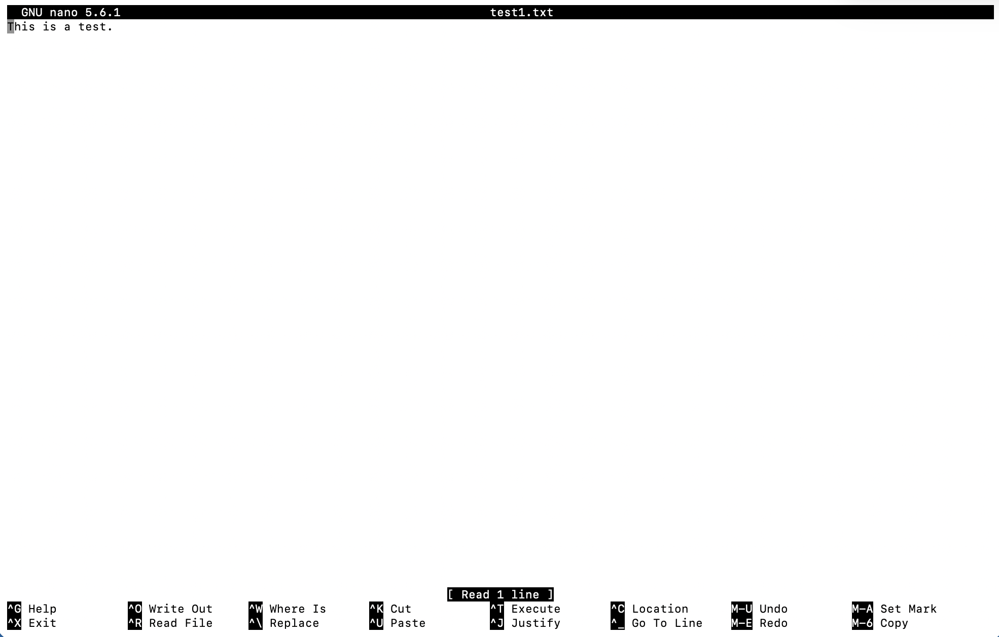{width=80%}

## Viewing File Contents

Sometimes it is useful to inspect the contents of a file directly from the terminal without opening a full text editor. Linux provides several commands that allow users to quickly view files.

Common commands include:

- `cat` – display the entire file  
- `less` – view a file page by page  
- `head` – show the first lines of a file  
- `tail` – show the last lines of a file

### Display an Entire File (`cat`)

The `cat` command prints the full contents of a file directly in the terminal.

```{bash}
cat hpc-text.txt
```

Example output:

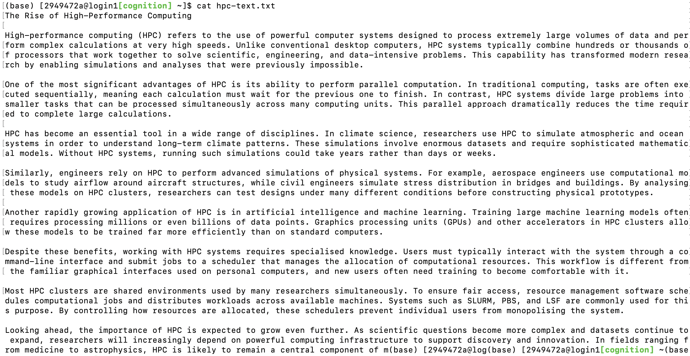{width=80%}

This command works well for **small files**, but it may flood the screen if the file is very large.


### View Files Page by Page (`less`)

The `less` command allows you to scroll through a file interactively.

Inside `less`, you can:

- press **Space** to scroll down
- press **b** to scroll up
- press **q** to quit

This is the preferred command for viewing **large files**.

Example:
```{bash}
less hpc-text.txt
```

Example output:

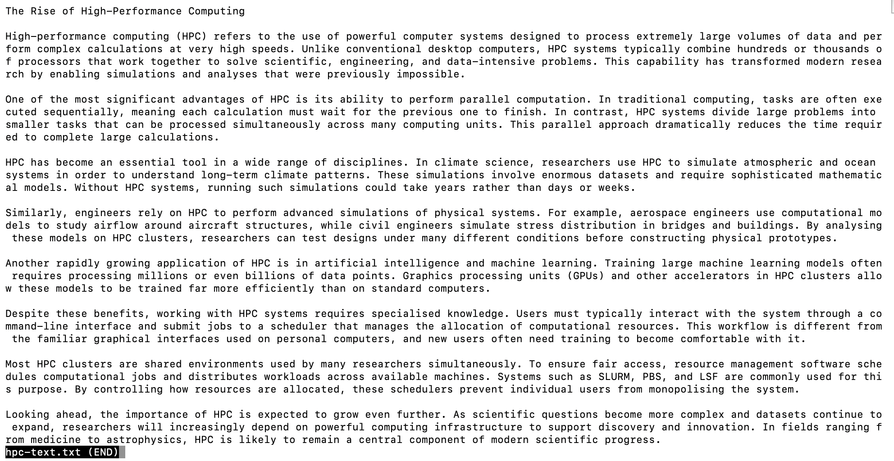{width=80%}


### View the Beginning of a File (`head`)

The `head` command shows the **first 10 lines** of a file.

Example:
```{bash}
head hpc-text.txt
```

Example output:

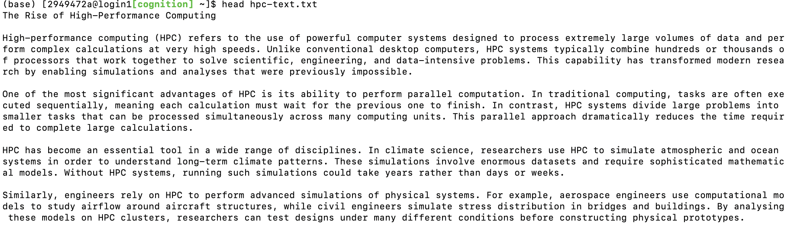{width=80%}

You can specify the number of lines:

```{bash}
head -n 5 file.txt
```

### View the End of a File (`tail`)

The `tail` command shows the **last 10 lines** of a file.

Example:
```{bash}
tail hpc-text.txt
```

Example output:

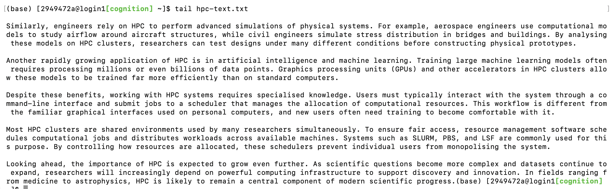{width=80%}

You can specify the number of lines:

```{bash}
tail -n 5 file.txt
```

These commands allow you to quickly inspect files without opening a text editor.

One key example is to take the last data in the log file, which is coming quite handy in some analysis:

```{bash}
tail -f output.log
```


### Practice Exercise

Try the following commands:
```{bash}
cat hpc-text.txt
less hpc-text.txt
head hpc-text.txt
tail hpc-text.txt
```

These commands allow you to quickly inspect files without opening a text editor and feel the difference between each methods.

## Running Programs

After navigating files and managing directories, the next step in using an HPC system is running programs. Programs can be executed directly from the terminal or submitted as jobs to the scheduler.

In general:

- small tests or simple scripts can be run directly in the terminal
- larger computations should be submitted to the scheduler

### Running a Script Directly using python

First, we create a simple script using nano. The file should directly printing "Hello world!" as a simple example.

Example:
```{bash}
nano testrun.py
```

Example output:

{width=80%}

In nano user interface, we use simple command to print "Hello world!".

Example:

```{bash}
print("Hello world!")
```

Example output:

{width=80%}

Then, we can check the hpc system if they have a python installed and we can use their python. We can check the module by using the following code

Example:

```{bash}
module avail
```

Example output:

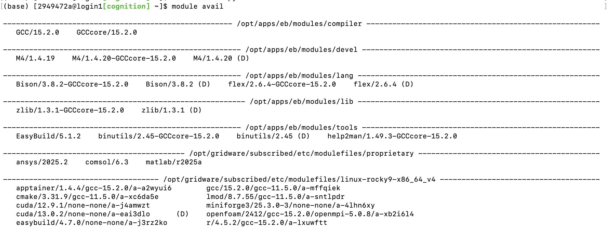{width=80%}

In the cognition, we have miniforge so we can load the miniforge. Copy the file names of the miniforge like the one below (updated 17/3/2026)

Example:

```{bash}
module load miniforge3/25.3.0-3/none-none/a-4lhn6xy 
```

Example output:

{width=80%}

From here on, we can make conda environment as usual, for simplicity, we will use the base.

Example:

```{bash}
conda activate base
```

Example output:

{width=80%}

From here, we can run the python3 file as usual.

Example:

```{bash}
python testrun.py
```

Example output:

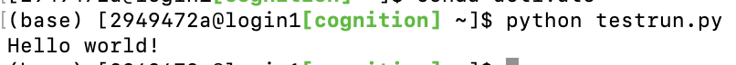{width=80%}

However, when trying to run the python notebook (ipynb files), we need to convert it first to a standard python notebook. 

Example:

```{bash}
jupyter nbconvert --to python hello-world.ipynb
python hello-world.py
```

Example output:

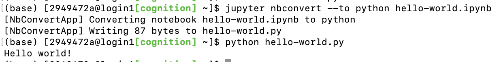{width=80%}
